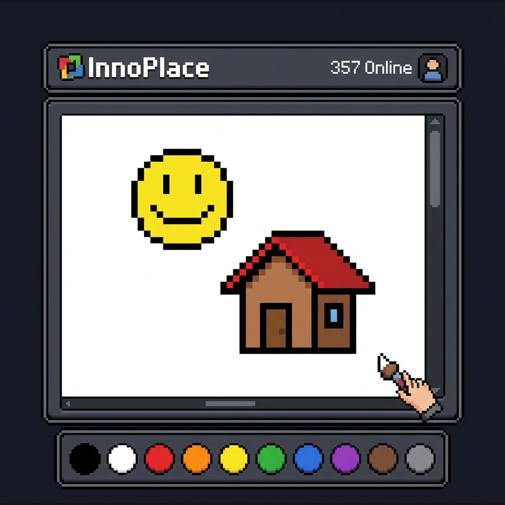

# InnoPlace

**InnoPlace**, kullanıcıların ortak bir tuval üzerinde piksel yerleştirerek sanat eserleri oluşturabildiği, gerçek zamanlı, çok oyunculu bir web tabanlı piksel sanat oyunudur.

🌐 **Hemen Oyna:** [www.innomis.tr/innoplace](http://www.innomis.tr/innoplace)

## 🎮 Oyun Hakkında

Bu proje bir "hack" veya zararlı yazılım değildir. Tamamen eğlence amaçlı geliştirilmiş, topluluk odaklı bir oyundur. Reddit'in ünlü r/place etkinliğinden esinlenilmiştir.

### Özellikler

- **Gerçek Zamanlı Etkileşim:** Diğer kullanıcıların koyduğu pikselleri anlık olarak görün.
- **Geniş Renk Paleti:** Çeşitli renk seçenekleriyle yaratıcılığınızı konuşturun.
- **Bekleme Süresi (Cooldown):** Adil bir oyun deneyimi için her piksel yerleştirme arasında kısa bir bekleme süresi vardır.
- **Zoom ve Pan:** Tuval üzerinde rahatça gezinin ve yakınlaşın.
- **Mobil Uyumlu:** Telefon ve tabletlerde sorunsuz çalışır.

## 🚀 Kurulum

Bu projeyi kendi sunucunuzda çalıştırmak için:

1.  Dosyaları sunucunuza yükleyin.
2.  Veritabanı bağlantı ayarlarını yapılandırın (gerekirse).
3.  Tarayıcınızda `index.php` veya `innoplace.php` dosyasını açın.

## 🛠️ Teknolojiler

- **Frontend:** HTML5, CSS3, JavaScript (Canvas API)
- **Backend:** PHP
- **Veritabanı:** MySQL (Piksel verilerini saklamak için)

## 🤝 Katkıda Bulunma

Projeye katkıda bulunmak isterseniz, lütfen bir "Pull Request" gönderin veya sorunları "Issues" bölümünden bildirin.

---
*İyi eğlenceler!*
